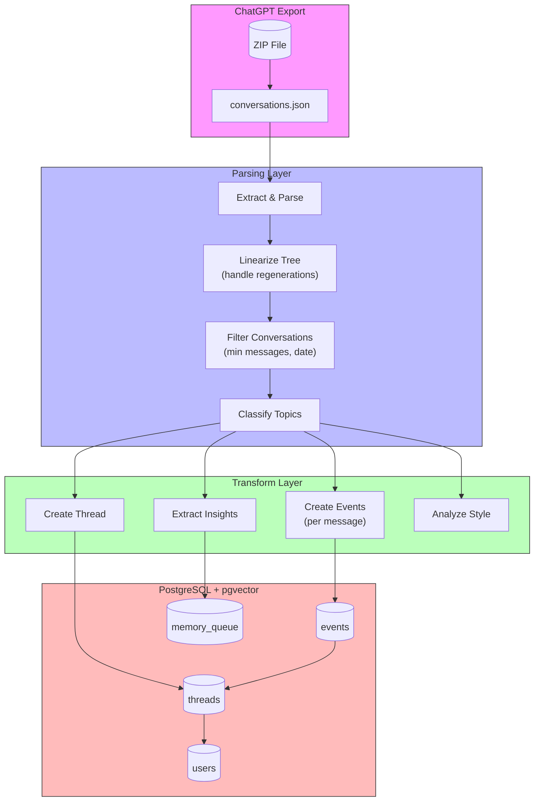
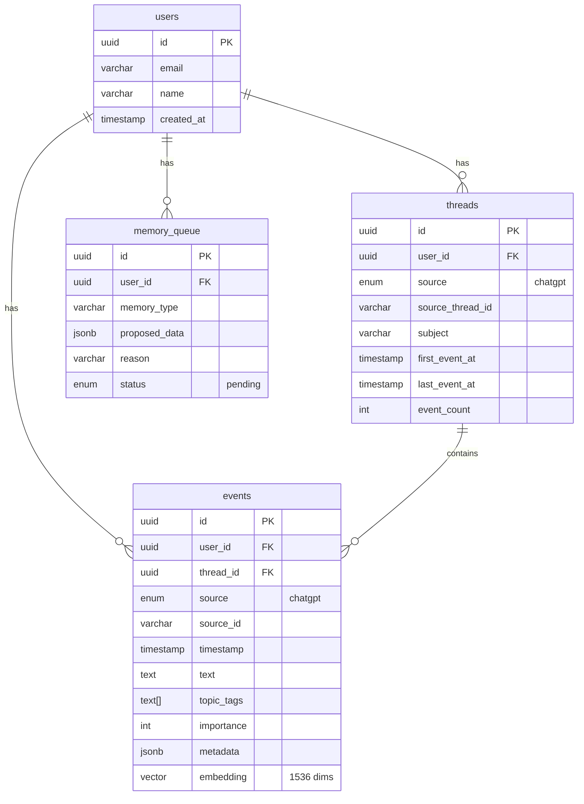
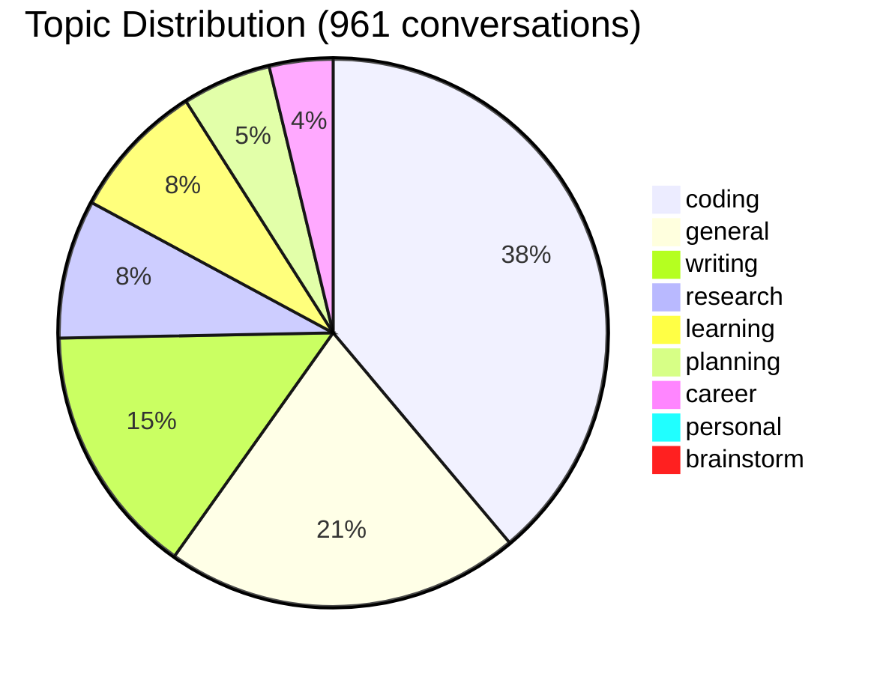
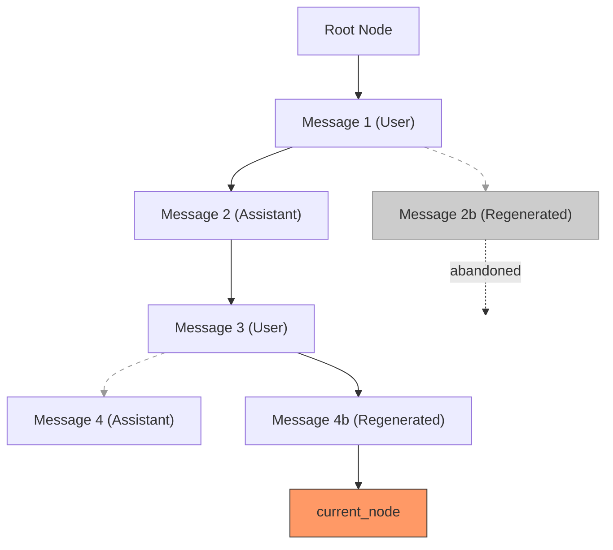
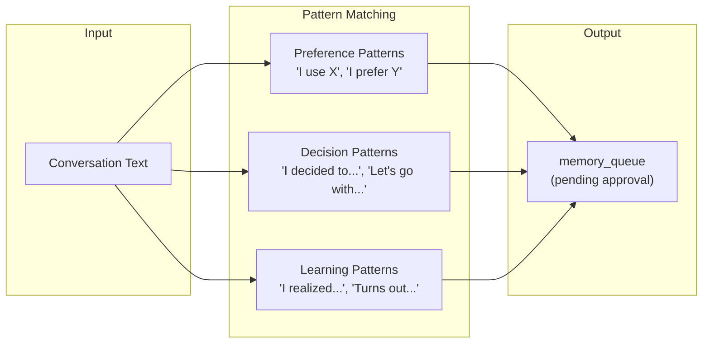

# ChatGPT Data Architecture

> **Status:** ✅ Completed  
> **Date:** February 2, 2026  
> **Data Imported:** 15,052 messages across 961 conversations

---

## Overview

This document explains how ChatGPT conversation history is transformed and stored in the Personal Operator database.

---

## Data Flow



---

## Database Schema



---

## Data Mapping

### ChatGPT Conversation → Thread

| ChatGPT Field | Thread Column | Notes |
|---------------|---------------|-------|
| `title` | `subject` | Conversation title |
| `create_time` | `first_event_at` | Unix timestamp → Date |
| `update_time` | `last_event_at` | Unix timestamp → Date |
| `id` or hash | `source_thread_id` | Unique identifier |
| — | `source` | Always `'chatgpt'` |
| — | `event_count` | Calculated from messages |

### ChatGPT Message → Event

| ChatGPT Field | Event Column | Notes |
|---------------|--------------|-------|
| `message.id` | `source_id` | Message UUID |
| `message.create_time` | `timestamp` | When sent |
| `message.content.parts[]` | `text` | Joined text content |
| — | `source` | Always `'chatgpt'` |
| — | `topic_tags` | Auto-classified |
| `message.author.role` | `metadata.role` | user/assistant |
| `message.metadata.model_slug` | `metadata.model` | gpt-4, etc |
| Code detection | `metadata.has_code` | Boolean |

### Metadata JSON Structure

```json
{
  "role": "user",
  "model": "gpt-4",
  "has_code": true,
  "content_type": "text"
}
```

---

## Topic Classification

Conversations are auto-tagged based on keyword patterns:



### Classification Rules

| Topic | Trigger Keywords |
|-------|-----------------|
| `coding` | code, function, error, debug, api, typescript, python |
| `writing` | write, draft, email, essay, article, blog |
| `research` | explain, what is, how does, compare, difference |
| `planning` | plan, schedule, roadmap, strategy, goals |
| `career` | job, interview, resume, salary, startup |
| `personal` | i feel, relationship, family, health |
| `learning` | learn, tutorial, understand, teach, example |

---

## Message Linearization

ChatGPT stores conversations as a tree (regenerations create branches). We linearize by following the path from `current_node` back to root:



**Result:** Only the canonical path (what user last saw) is imported.

---

## Insight Extraction

The import process extracts potential memories for review:



### Extracted Insights Summary

| Type | Count | Example |
|------|-------|---------|
| Preferences | 63 | "I prefer TypeScript" |
| Decisions | 6 | "Decided to use PostgreSQL" |
| Learnings | 18 | "Learned that batch processing is faster" |

---

## Style Analysis

Automatically detected from message patterns:

```yaml
averageMessageLength: 1,117 chars
usesCodeBlocks: true
technicalLevel: high
questionStyle: detailed
preferredFormat: bullets
```

---

## Query Examples

### Count messages by topic
```sql
SELECT 
  unnest(topic_tags) as topic,
  COUNT(*) as count
FROM events 
WHERE source = 'chatgpt'
GROUP BY topic
ORDER BY count DESC;
```

### Search conversations
```sql
SELECT 
  t.subject,
  COUNT(e.id) as messages,
  MIN(e.timestamp) as started
FROM threads t
JOIN events e ON e.thread_id = t.id
WHERE t.source = 'chatgpt'
  AND e.text ILIKE '%typescript%'
GROUP BY t.id
ORDER BY started DESC
LIMIT 10;
```

### Full-text search
```sql
SELECT * FROM search_events(
  '8949a988-a1d0-4ceb-8ea5-9b2f120b2444',  -- user_id
  'startup advice',                          -- query
  10                                         -- limit
);
```

---

## Files Involved

| File | Purpose |
|------|---------|
| `src/ingest/chatgpt/types.ts` | TypeScript interfaces |
| `src/ingest/chatgpt/parser.ts` | ZIP extraction, linearization |
| `src/ingest/chatgpt/insights.ts` | Memory extraction |
| `src/ingest/chatgpt/importer.ts` | Main orchestrator |
| `src/scripts/import-chatgpt-full.ts` | CLI entry point |
| `schemas/db-schema.sql` | Database schema |

---

## Next Steps

1. ~~**Generate embeddings**~~ — ✅ Completed (see [embedding-search-architecture.md](./embedding-search-architecture.md))
2. **Build search API** — Query from chat interface
3. **Review memories** — Approve/reject extracted insights

