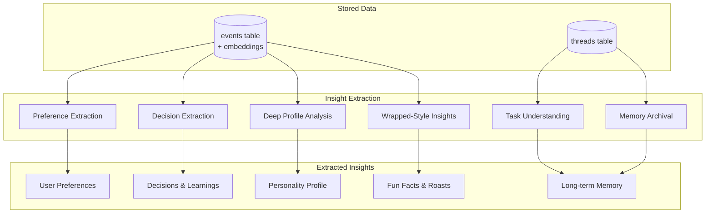

# ChatGPT Data Insight Extraction Prompts

> **Status:** ✅ Documentation  
> **Date:** February 5, 2026  
> **Purpose:** Explains all LLM prompts used to extract insights from ChatGPT conversation data

---

## Overview

After ChatGPT data is imported and embeddings are generated, the system uses several LLM prompts to extract meaningful insights. This document catalogs all prompts and explains what each one is designed to discover.



---

## 1. Preference Extraction Prompt

**File:** `src/ingest/chatgpt/insights.ts`  
**Model:** `gpt-4o-mini`  
**Purpose:** Extracts explicit and implied user preferences from conversations

### Prompt

```
Analyze this ChatGPT conversation between the user and assistant. Extract any 
preferences, personal facts, or habits the USER explicitly states or strongly implies.

Focus on:
- Technology preferences (languages, frameworks, tools, editors)
- Communication preferences (verbosity, format, tone)
- Work context (role, company, industry)
- Personal facts (only if directly stated)

Output as JSON:
{
  "preferences": [
    {
      "category": "technology|communication|work|personal",
      "key": "specific_key_name",
      "value": "the preference value",
      "confidence": 0.0-1.0
    }
  ]
}

Only include items where the user clearly states or strongly implies the preference 
(confidence > 0.7).
If no clear preferences are found, return {"preferences": []}.

CONVERSATION:
[conversation text appended here]
```

### Insights Extracted

| Category | Key | Example Values |
|----------|-----|----------------|
| `technology` | `programming_language` | "TypeScript", "Python" |
| `technology` | `framework` | "React", "FastAPI" |
| `technology` | `editor` | "VS Code", "Cursor" |
| `communication` | `response_length` | "concise", "detailed" |
| `communication` | `format` | "bullet points", "prose" |
| `work` | `company` | Company name |
| `work` | `role` | "Senior Engineer", "Founder" |

---

## 2. Decision & Learning Extraction Prompt

**File:** `src/ingest/chatgpt/insights.ts`  
**Model:** `gpt-4o-mini`  
**Purpose:** Captures decisions made and lessons learned during conversations

### Prompt

```
Analyze this ChatGPT conversation for any decisions the USER made or conclusions 
they reached.

A decision includes:
- What was decided
- Why (the reasoning, if stated)
- What alternatives were considered (if mentioned)

Output as JSON:
{
  "decisions": [
    {
      "summary": "Brief description of the decision",
      "reasoning": "Why they decided this (or empty string if not stated)",
      "alternatives": ["alt1", "alt2"],
      "confidence": 0.0-1.0
    }
  ],
  "learnings": [
    {
      "summary": "What they learned or realized",
      "context": "What prompted this learning",
      "confidence": 0.0-1.0
    }
  ]
}

Only include items with confidence > 0.7.
If no decisions or learnings are found, return {"decisions": [], "learnings": []}.

CONVERSATION:
[conversation text appended here]
```

### Insights Extracted

| Type | Fields | Example |
|------|--------|---------|
| **Decisions** | summary, reasoning, alternatives | "Decided to use PostgreSQL over MongoDB for relational data needs" |
| **Learnings** | summary, context | "Learned that batch processing is faster than streaming for this use case" |

---

## 3. Deep Profile Analysis Prompt

**File:** `src/scripts/analyze-profile.ts`  
**Model:** `claude-sonnet-4` or `gpt-4o`  
**Purpose:** Builds comprehensive user profile from conversation history

### Prompt

```
You are analyzing a user's ChatGPT conversation history to build a comprehensive profile. 

## Statistics
- Total messages: [X]
- User messages: [Y]
- Conversations: [Z]
- Date range: [start] to [end]
- Topic distribution: [topics with counts]
- Average message length: [N] characters
- Uses code blocks: [X]% of messages
- Question-based: [Y]% of messages

## Sample Messages
Here are representative messages from this user:
[60 sample messages with topic tags]

## Your Task
Analyze these messages to extract a comprehensive profile. Return ONLY a valid JSON 
object with this structure:

{
  "summary": "A 2-3 sentence summary of who this person is",
  "communication": {
    "style": "Description of their communication style",
    "averageLength": "short/medium/long with context",
    "formality": 1-5 scale (1=very casual, 5=very formal),
    "usesCodeBlocks": true/false,
    "preferredFormat": "prose/bullets/mixed",
    "vocabulary": ["notable words or phrases they use"]
  },
  "professional": {
    "role": "Their job title/role",
    "company": "Company they work for",
    "industry": "Industry/domain",
    "skills": ["list of skills mentioned"],
    "expertise": ["areas of deep knowledge"]
  },
  "interests": {
    "topics": ["topics they frequently discuss"],
    "learningAreas": ["things they're trying to learn"],
    "recurringThemes": ["themes that come up repeatedly"]
  },
  "technical": {
    "languages": ["programming languages"],
    "frameworks": ["frameworks and libraries"],
    "tools": ["tools and services"],
    "platforms": ["platforms they work with"],
    "preferences": {"key": "value pairs of preferences"}
  },
  "patterns": {
    "problemSolving": "How they approach problems",
    "decisionMaking": "How they make decisions",
    "questionStyle": "How they ask questions",
    "workPatterns": "Patterns in how they work"
  },
  "insights": ["5-10 specific insights about this person that would help an AI 
               assistant serve them better"]
}

Be specific and evidence-based. Only include things you can infer from the actual messages.
```

### Insights Extracted

| Category | Example Insights |
|----------|------------------|
| **Professional** | Role, company, industry, skills, expertise areas |
| **Communication** | Style, formality level, preferred format, vocabulary |
| **Technical** | Languages, frameworks, tools, platform preferences |
| **Behavioral** | Problem-solving approach, decision-making style, work patterns |
| **Interests** | Learning areas, recurring themes, topic focus |

---

## 4. "Wrapped" Fun Insights Prompt

**File:** `src/server.ts` (`/api/wrapped/insights`)  
**Model:** `gpt-4o-mini`  
**Purpose:** Generates Spotify Wrapped-style fun analysis of ChatGPT usage

### Prompt

```
You are an AI analyst creating a fun "Spotify Wrapped" style summary for someone's 
ChatGPT usage.

You're given samples of their actual messages, conversation titles, AND detailed 
behavioral stats. Your job is to:
1. Identify interesting patterns in what they talk about
2. Make observations about their personality/interests based on the content
3. Be funny, warm, and slightly roast-y (but nice!)
4. Generate specific, personalized insights - NOT generic observations
5. Use the behavioral stats to make data-driven jokes and observations

Output a JSON object with these fields:
{
  "personality": {
    "title": "A fun 2-4 word personality title like 'The Midnight Architect' 
             or 'Code Whisperer Supreme'",
    "description": "A 1-2 sentence description of their ChatGPT personality"
  },
  "topObsession": {
    "topic": "The thing they clearly can't stop talking about",
    "roast": "A funny one-liner roasting them about it"
  },
  "hiddenPattern": "Something surprising you noticed in their usage or stats",
  "aiPrediction": "A funny prediction about what they'll ask ChatGPT next",
  "spiritAnimal": {
    "animal": "An animal that matches their ChatGPT energy (consider time patterns!)",
    "reason": "Why this animal - reference specific stats"
  },
  "funFacts": [
    "5-6 specific, personalized fun facts - mix content-based AND stat-based observations"
  ],
  "oneLineRoast": "One perfect roast line about their ChatGPT usage",
  "compliment": "One genuine compliment about their curiosity/growth",
  "trendInsight": "What their usage trend says about them",
  "timePersonality": "A funny description based on when they use ChatGPT",
  "evolutionNote": "How their interests have evolved over time",
  "hiddenTheme": "A surprising hidden theme you found in the semantic clusters",
  "questionStyle": "What their question patterns reveal about how they think"
}

Be specific! Reference actual topics/words AND actual numbers from the stats.
```

### Data Provided to Prompt

The prompt receives rich contextual data:

| Data Type | Description |
|-----------|-------------|
| **Behavioral Stats** | Usage trend %, night owl score, weekend ratio, peak days |
| **Conversation Styles** | Quick chats vs marathon sessions |
| **Model Preferences** | Which GPT models used most |
| **Topic Evolution** | Old interests vs recent interests |
| **Sample Messages** | 100 random user messages |
| **Conversation Titles** | 200 random titles |
| **Semantic Themes** | Embedding-based theme discovery (not keyword!) |
| **Question Patterns** | Sample "how do", "what is", "why" questions |

### Semantic Theme Discovery (Embedding-Based)

The system uses **semantic probes** to discover what you actually talk about:

```javascript
const themeProbes = [
  { name: 'Business & Entrepreneurship', 
    probe: 'starting a business, startup ideas, entrepreneurship, monetization...' },
  { name: 'AI Image Generation', 
    probe: 'generate an image, create a picture, AI art, visual design...' },
  { name: 'Career & Growth', 
    probe: 'career advice, job interview, resume, professional development...' },
  { name: 'Learning & Education', 
    probe: 'how does this work, explain to me, teach me, understand better...' },
  { name: 'Creative Writing', 
    probe: 'write a story, creative writing, poem, narrative, fiction...' },
  { name: 'Technical Architecture', 
    probe: 'system design, architecture, scalability, database design...' },
  { name: 'Personal Life', 
    probe: 'relationship advice, personal problems, life decisions...' },
  { name: 'Productivity & Organization', 
    probe: 'organize my tasks, productivity tips, time management...' },
];
```

For each theme, the system:
1. Generates an embedding for the semantic probe
2. Finds messages with >0.40 cosine similarity
3. Counts matches and extracts samples
4. Only includes themes with >5 matching messages

---

## 5. Task Understanding Prompt

**File:** `src/tasks/understanding-engine.ts`  
**Model:** Fast model (configurable)  
**Purpose:** Classifies natural language utterances for task tracking

### Prompt

```
You are a task understanding engine. You analyze natural speech to identify 
task-related intent.

Your job is to:
1. Classify the intent of the utterance
2. Extract task information if present
3. Identify if this refers to an existing task or is a new one

INTENT CLASSIFICATIONS:
- "starting": User is beginning or declaring a new task
  Examples: "I need to call mom", "Going to work on the report"
  
- "progress": User is reporting progress on a task
  Examples: "Making good progress on the report", "Halfway done"
  
- "completed": User finished a task
  Examples: "Done!", "Finished the report", "Got the groceries"
  
- "blocked": User is stuck or pausing
  Examples: "Stuck on the API issue", "Waiting for Bob's response"
  
- "query": User is asking about tasks
  Examples: "What was I working on?", "Show my tasks"
  
- "not_task": Not task-related
  Examples: "The weather is nice", "Hello", "Thanks"

IMPORTANT RULES:
1. Be generous with task detection - users speak naturally
2. "Done" or "finished" near task context = completed
3. "Working on" or "doing" = progress
4. "Need to" or "have to" or "should" = starting
5. When unsure, prefer starting > not_task for actionable statements

Respond with valid JSON only.
```

### Output Structure

```json
{
  "intent": "starting|progress|completed|blocked|query|not_task",
  "confidence": 0.0-1.0,
  "taskReference": "what task this refers to (if any)",
  "isNewTask": true/false,
  "extractedTitle": "task title if new task",
  "extractedDescription": "description if provided",
  "extractedTags": ["tags", "if", "detectable"],
  "extractedPriority": 1-5 or null,
  "extractedDueDate": "ISO date string if mentioned",
  "notes": "any additional context extracted",
  "reasoning": "brief explanation of classification"
}
```

---

## 6. Memory Archival Prompt

**File:** `src/tasks/memory-pipeline.ts`  
**Model:** Fast model (configurable)  
**Purpose:** Summarizes completed tasks for long-term memory storage

### Prompt

```
You summarize completed tasks into long-term memories.

Given a task and its history, create:
1. A concise summary (1-2 sentences) of what was accomplished
2. Context about how/why it was done
3. Relevant tags for future retrieval
4. Any revealed preferences (optional) - patterns about how the user works

Output JSON:
{
  "summary": "Brief summary of completed task",
  "context": "Additional context about the task",
  "tags": ["tag1", "tag2"],
  "revealedPreference": {
    "key": "preference key (e.g., 'communication_style')",
    "value": "preference value"
  } // or null if none detected
}

Focus on actionable, searchable information. Tags should be useful for future retrieval.
```

### Input Data

The prompt receives:
- Task title and description
- Tags and completion timestamp
- Update history (status changes, notes)
- Related utterances (voice/text inputs)

---

## Pattern-Based Extraction (No LLM)

In addition to LLM prompts, the system uses regex patterns for fast extraction:

### Preference Patterns

```javascript
const PREFERENCE_PATTERNS = [
  // Technology preferences
  /\b(?:i (?:use|prefer|like|love|always use|work with))\s+([a-zA-Z0-9\-_.]+)/gi,
  /\b(?:my (?:favorite|preferred|go-to))\s+(?:language|framework|tool)\s+(?:is\s+)?([a-zA-Z0-9\-_.]+)/gi,
  /\b(?:i'm a|i am a)\s+([a-zA-Z]+)\s+(?:developer|engineer|programmer)/gi,
  
  // Communication preferences
  /\b(?:keep it|be)\s+(brief|short|concise|detailed|verbose)/gi,
  /\b(?:i prefer)\s+(bullet points|paragraphs|lists|headers)/gi,
  
  // Work preferences
  /\b(?:i work (?:at|for|on))\s+([a-zA-Z0-9\s]+?)(?:\.|,|\s+and|\s+as)/gi,
];
```

### Decision Patterns

```javascript
const DECISION_PATTERNS = [
  /\b(?:i(?:'ve)?\s+decided|i(?:'m)?\s+going\s+(?:to|with)|let(?:'s)?\s+go\s+with)/gi,
  /\b(?:after\s+(?:considering|thinking|weighing),?\s*i(?:'ll)?\s+)/gi,
];
```

### Learning Patterns

```javascript
const LEARNING_PATTERNS = [
  /\b(?:i\s+(?:learned|realized|discovered|found\s+out|understood))\s+(?:that\s+)?/gi,
  /\b(?:turns\s+out|it\s+seems|apparently)\s+/gi,
  /\b(?:the\s+(?:key|trick|solution|answer)\s+(?:is|was))\s+/gi,
];
```

---

## Summary of Insights Extracted

| Insight Type | Source | Storage Location |
|--------------|--------|------------------|
| Preferences | LLM + Patterns | `memory_queue` (pending review) |
| Decisions | LLM + Patterns | `memory_queue` |
| Learnings | LLM + Patterns | `memory_queue` |
| Profile Data | Deep Analysis | Profile markdown file |
| Fun Facts | Wrapped Analysis | API response / cache |
| Semantic Themes | Embedding similarity | API response |
| Task Intent | Understanding Engine | `tasks` table |
| Task Memories | Archival Pipeline | `episodic_memory` table |

---

## Files Reference

| File | Prompts | Purpose |
|------|---------|---------|
| `src/ingest/chatgpt/insights.ts` | 2 | Preference & Decision extraction |
| `src/scripts/analyze-profile.ts` | 1 | Deep profile analysis |
| `src/server.ts` | 1 | Wrapped-style fun insights |
| `src/tasks/understanding-engine.ts` | 1 | Task classification |
| `src/tasks/memory-pipeline.ts` | 1 | Task archival |

---

## How to Run Each Analysis

```bash
# Deep Profile Analysis
npm run profile:analyze

# Generate Wrapped Insights (via API)
curl http://localhost:3333/api/wrapped/insights

# Force regenerate (bypass cache)
curl http://localhost:3333/api/wrapped/insights?regenerate=true

# Import with insight extraction
npm run import:chatgpt ./path/to/export.zip
```

---

*This document catalogs all LLM prompts used to extract insights from ChatGPT data.*

