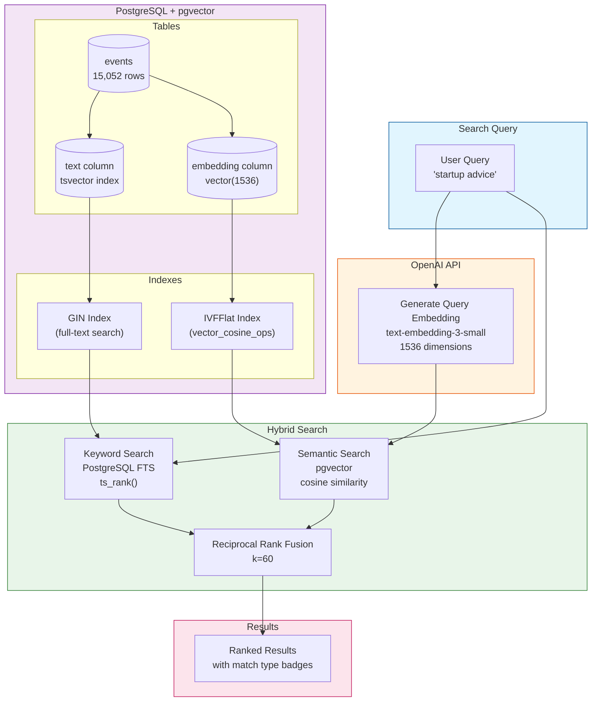
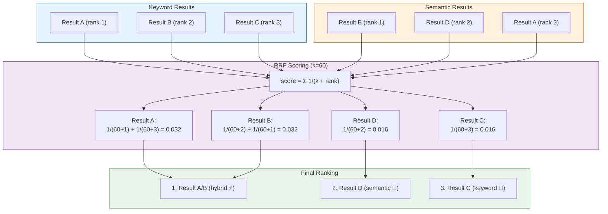

# Embedding & Search Architecture

> **Status:** ✅ Completed  
> **Date:** February 2, 2026  
> **Embeddings Generated:** 6,559 user messages  
> **Search Type:** Hybrid (keyword + semantic)

---

## Overview

This document explains how embeddings are generated and how the hybrid search system retrieves relevant context from the PostgreSQL database.

---

## Architecture Diagram



---

## Embedding Pipeline

### Data Flow

```mermaid
flowchart LR
    subgraph Source["Source Data"]
        EVENTS["events table\n(15,052 total)"]
    end

    subgraph Filter["Filter"]
        USER_ONLY["User messages only\n(role = 'user')"]
        MIN_LENGTH["Length > 10 chars"]
    end

    subgraph Batch["Batch Processing"]
        CHUNKS["100 messages\nper batch"]
        PREPARE["Prepare text\n(truncate, clean)"]
    end

    subgraph API["OpenAI API"]
        EMBED["embeddings.create()\ntext-embedding-3-small"]
    end

    subgraph Store["Update Database"]
        UPDATE["UPDATE events\nSET embedding = ?"]
    end

    EVENTS --> USER_ONLY
    USER_ONLY --> MIN_LENGTH
    MIN_LENGTH --> CHUNKS
    CHUNKS --> PREPARE
    PREPARE --> EMBED
    EMBED --> UPDATE

    style Source fill:#ffecb3,stroke:#ff6f00
    style Filter fill:#e3f2fd,stroke:#1565c0
    style Batch fill:#f3e5f5,stroke:#7b1fa2
    style API fill:#fff3e0,stroke:#e65100
    style Store fill:#e8f5e9,stroke:#2e7d32
```



### Embedding Statistics

| Metric | Value |
|--------|-------|
| Total events | 15,052 |
| User messages | 6,559 |
| Assistant messages | 8,493 (not embedded) |
| Embedding model | `text-embedding-3-small` |
| Dimensions | 1,536 |
| Processing time | 100.5 seconds |
| Processing rate | 65.4/sec |
| Estimated cost | ~$0.04 |

### Why Only User Messages?

We embed user messages, not assistant responses, because:

1. **Search intent**: Users search for *their own* questions and context
2. **Cost efficiency**: 44% fewer embeddings to generate
3. **Relevance**: User messages contain the actual questions/decisions
4. **Deduplication**: Assistant responses often repeat context from user messages

---

## Search Strategies

### 1. Keyword Search (PostgreSQL Full-Text)

Uses PostgreSQL's built-in full-text search with `tsvector` and `tsquery`.

```sql
-- Find events matching keywords
SELECT 
  id, text, timestamp,
  ts_rank(to_tsvector('english', text), 
          plainto_tsquery('english', 'startup advice')) as rank
FROM events
WHERE to_tsvector('english', text) @@ plainto_tsquery('english', 'startup advice')
ORDER BY rank DESC
LIMIT 20;
```

**Strengths:**
- Exact keyword matches
- Fast with GIN index
- No external API calls
- Handles stemming (startup → start)

**Weaknesses:**
- Misses semantic meaning
- "startup advice" won't find "entrepreneurship tips"

### 2. Semantic Search (pgvector)

Uses vector similarity to find conceptually related content.

```sql
-- Find semantically similar events
SELECT 
  id, text, timestamp,
  1 - (embedding <=> $query_embedding::vector) as similarity
FROM events
WHERE embedding IS NOT NULL
ORDER BY embedding <=> $query_embedding::vector
LIMIT 20;
```

**Strengths:**
- Finds related concepts
- "startup advice" finds "investment strategies"
- Works across different phrasings

**Weaknesses:**
- Requires API call for query embedding
- May miss exact keyword matches
- Slightly higher latency

### 3. Hybrid Search (Reciprocal Rank Fusion)

Combines both approaches using RRF algorithm.



**RRF Formula:**

```
score(doc) = Σ 1 / (k + rank_i)
```

Where:
- `k = 60` (constant to prevent high-ranked items from dominating)
- `rank_i` = position in each result list (0-indexed)

**Result badges:**
- 📝 = keyword match only
- 🧠 = semantic match only  
- ⚡ = hybrid (found by both)

---

## Database Schema

### Events Table (with embedding)

```sql
CREATE TABLE events (
  id UUID PRIMARY KEY,
  user_id UUID REFERENCES users(id),
  source event_source NOT NULL,
  timestamp TIMESTAMP WITH TIME ZONE NOT NULL,
  text TEXT NOT NULL,
  thread_id UUID,
  topic_tags TEXT[] DEFAULT '{}',
  importance INTEGER DEFAULT 3,
  metadata JSONB DEFAULT '{}',
  
  -- Vector embedding for semantic search
  embedding vector(1536),
  
  created_at TIMESTAMP WITH TIME ZONE DEFAULT NOW()
);
```

### Indexes

```sql
-- Full-text search index
CREATE INDEX idx_events_text_search 
  ON events USING gin(to_tsvector('english', text));

-- Vector similarity index (IVFFlat)
CREATE INDEX idx_events_embedding 
  ON events USING ivfflat (embedding vector_cosine_ops)
  WITH (lists = 100);
```

### Search Functions

```sql
-- Keyword search function
CREATE FUNCTION search_events(
  p_user_id UUID,
  p_query TEXT,
  p_limit INTEGER DEFAULT 20
) RETURNS TABLE (...);

-- Semantic search function
CREATE FUNCTION search_events_semantic(
  p_user_id UUID,
  p_embedding vector(1536),
  p_limit INTEGER DEFAULT 20
) RETURNS TABLE (...);
```

---

## CLI Commands

### Generate Embeddings

```bash
# Backfill embeddings for existing events
npm run embeddings:backfill

# Preview without generating
npm run embeddings:backfill --dry-run

# Custom batch size
npm run embeddings:backfill --batch-size 50
```

### Search

```bash
# Hybrid search (default)
npm run search "startup advice"

# Keyword only (no API call)
npm run search "typescript patterns" --keyword-only

# Semantic only
npm run search "how to raise money" --semantic-only

# Custom limit
npm run search "what did I decide" --limit 5
```

---

## Files Involved

| File | Purpose |
|------|---------|
| `src/lib/embeddings.ts` | OpenAI embedding client |
| `src/scripts/backfill-embeddings.ts` | Batch embedding generator |
| `src/scripts/search.ts` | Search CLI with hybrid search |
| `schemas/db-schema.sql` | Vector column and indexes |

---

## Performance Characteristics

| Operation | Latency | Notes |
|-----------|---------|-------|
| Keyword search | ~50ms | GIN index lookup |
| Semantic search | ~200ms | IVFFlat + API call |
| Hybrid search | ~250ms | Parallel execution |
| Embedding generation | ~15ms/item | Batched at 100 |

---

## Next Steps

1. **Build search API** — `POST /api/search` endpoint for chat interface
2. **Context packing** — Assemble results into LLM prompts with citations
3. **Reranking** — Cross-encoder for improved relevance

