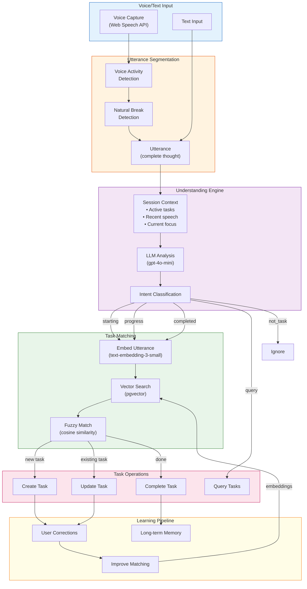
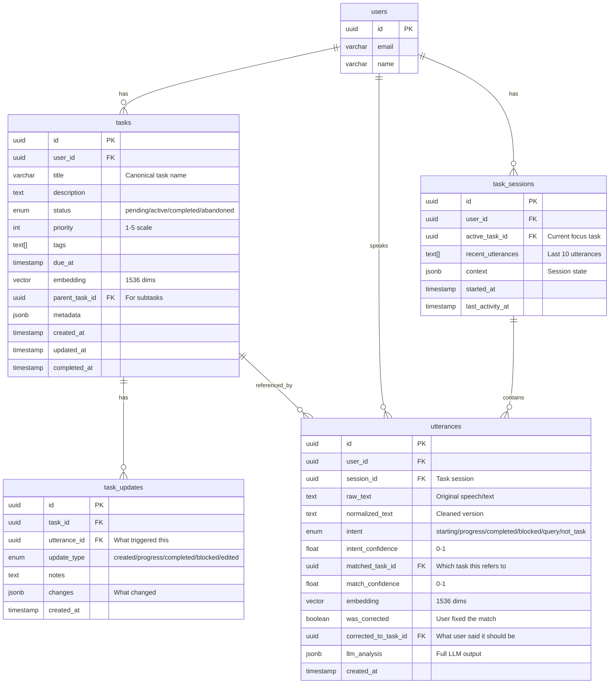
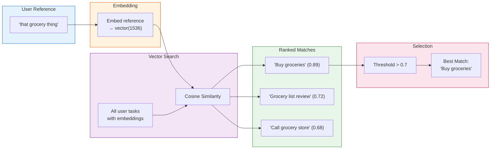
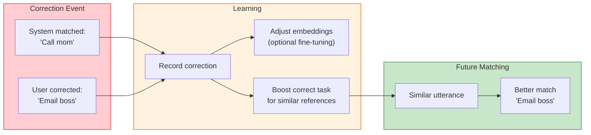
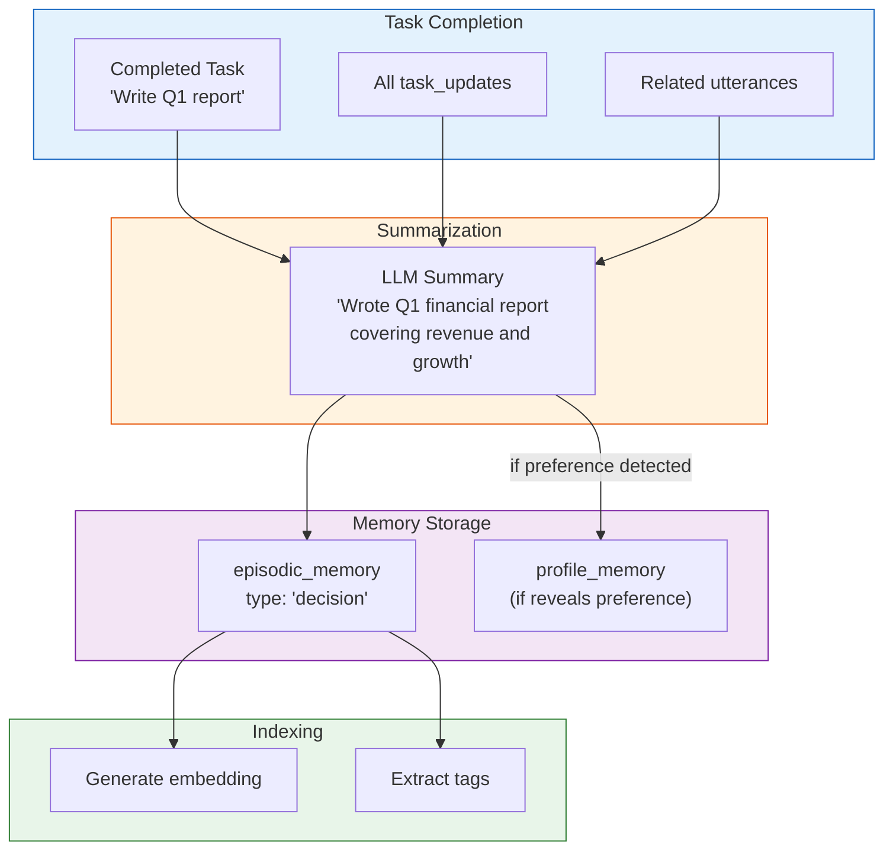
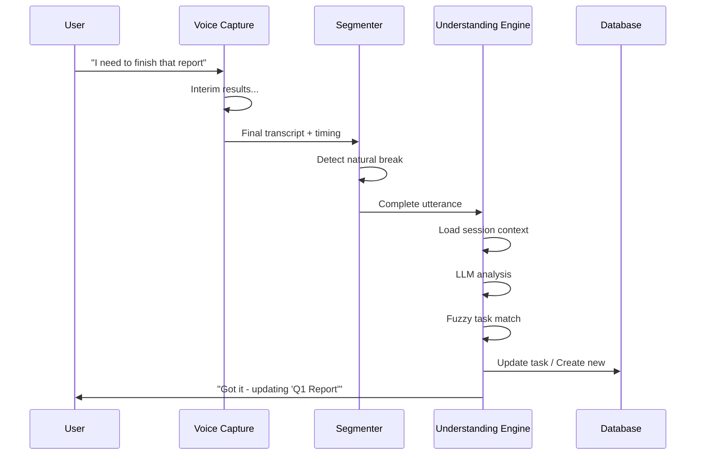

# Neural Task Understanding Architecture

> **Status:** 🚧 In Progress  
> **Date:** February 2, 2026  
> **Style:** Jarvis-like natural language task tracking

---

## Overview

This system enables natural, conversational task tracking. Instead of rigid commands like "create task: buy groceries", users speak naturally:

> "I need to pick up some groceries today"  
> "Made progress on that grocery thing"  
> "Done with the shopping"

The system understands intent, matches fuzzy references to existing tasks, and learns from corrections over time.

---

## Core Concepts

### The Jarvis Principle

| Traditional Task Systems | Neural Task Understanding |
|-------------------------|---------------------------|
| "Create task: buy groceries" | "I need to pick up groceries" |
| "Update task #47 status: in-progress" | "Working on the grocery thing" |
| "Complete task #47" | "Done shopping" |
| Requires exact task IDs | Fuzzy matching via embeddings |
| Rigid command syntax | Natural conversation |

---

## Architecture Diagram



---

## Database Schema



---

## Intent Classification

The LLM classifies each utterance into one of these intents:

| Intent | Description | Example |
|--------|-------------|---------|
| `starting` | User is beginning or declaring a new task | "I need to call mom", "Going to work on the report" |
| `progress` | User is reporting progress on a task | "Making good progress on the report", "Halfway done with groceries" |
| `completed` | User finished a task | "Done!", "Finished the report", "Got the groceries" |
| `blocked` | User is stuck or pausing | "Stuck on the API issue", "Waiting for Bob's response" |
| `query` | User is asking about tasks | "What was I working on?", "Show my tasks" |
| `not_task` | Not task-related | "The weather is nice", "Hello" |

### LLM Prompt Template

```
You analyze natural speech to understand task-related intent.

CONTEXT:
- Active task: {active_task}
- Recent tasks: {recent_tasks}
- Recent utterances: {recent_speech}

UTTERANCE: "{utterance}"

Classify the intent and extract task information:

{
  "intent": "starting|progress|completed|blocked|query|not_task",
  "confidence": 0.0-1.0,
  "task_reference": "what task this refers to (if any)",
  "is_new_task": true/false,
  "extracted_title": "task title if new",
  "notes": "any additional context",
  "reasoning": "brief explanation"
}
```

---

## Fuzzy Task Matching

When a user references a task vaguely ("that grocery thing"), we use embeddings to find the best match:



### Matching Algorithm

```typescript
async function matchTask(
  userId: string,
  reference: string,
  context: SessionContext
): Promise<TaskMatch | null> {
  // 1. Check if LLM already identified the task
  if (context.recentTaskId) {
    const task = await getTask(context.recentTaskId);
    if (task) return { task, confidence: 0.95, source: 'context' };
  }

  // 2. Embed the reference
  const embedding = await embed(reference);

  // 3. Vector search against user's tasks
  const candidates = await searchTasksBySimilarity(userId, embedding, 5);

  // 4. Apply context boost (recent/active tasks score higher)
  const scored = candidates.map(c => ({
    ...c,
    score: c.similarity + contextBoost(c, context)
  }));

  // 5. Return best match if above threshold
  const best = scored[0];
  if (best && best.score >= 0.7) {
    return { task: best.task, confidence: best.score, source: 'embedding' };
  }

  return null; // No confident match - likely a new task
}
```

---

## Session Context

The system maintains awareness of what the user is working on:

```typescript
interface SessionContext {
  // Current session
  sessionId: string;
  startedAt: Date;
  lastActivityAt: Date;

  // Task focus
  activeTask: Task | null;        // Currently focused task
  recentTasks: Task[];            // Last 5 tasks mentioned
  
  // Speech history
  recentUtterances: Utterance[];  // Last 10 utterances
  
  // Derived state
  currentFocus: string;           // "working on report", "planning groceries"
  mood: string;                   // "focused", "distracted", "frustrated"
}
```

### Context Decay

Context importance decays over time:

| Time Since | Context Weight |
|------------|---------------|
| < 5 min | 1.0 (full context) |
| 5-15 min | 0.7 |
| 15-60 min | 0.4 |
| > 1 hour | 0.1 |
| > 4 hours | New session |

---

## Learning from Corrections

When users correct mismatched tasks, the system learns:



### Correction Storage

```sql
-- When user corrects a match
UPDATE utterances SET
  was_corrected = true,
  corrected_to_task_id = 'correct-task-uuid'
WHERE id = 'utterance-uuid';

-- Use corrections to improve future matching
SELECT 
  u.raw_text,
  u.matched_task_id as wrong_match,
  u.corrected_to_task_id as correct_match
FROM utterances u
WHERE u.was_corrected = true
  AND u.user_id = $1;
```

---

## Task → Long-term Memory Pipeline

Completed tasks become long-term memories:



### Memory Extraction

```typescript
async function archiveCompletedTask(task: Task): Promise<void> {
  // Get all related data
  const updates = await getTaskUpdates(task.id);
  const utterances = await getTaskUtterances(task.id);

  // Summarize with LLM
  const summary = await llm.chat(
    ARCHIVE_SYSTEM_PROMPT,
    formatTaskForArchive(task, updates, utterances)
  );

  // Store as episodic memory
  await db.query(`
    INSERT INTO episodic_memory 
      (user_id, type, summary, context, timestamp, tags, embedding)
    VALUES 
      ($1, 'decision', $2, $3, $4, $5, $6)
  `, [
    task.userId,
    summary.summary,
    summary.context,
    task.completedAt,
    summary.tags,
    await embed(summary.summary)
  ]);

  // Check for preferences to extract
  if (summary.revealedPreference) {
    await queueMemory({
      type: 'profile',
      category: 'preference',
      key: summary.revealedPreference.key,
      value: summary.revealedPreference.value,
      reason: `Inferred from completed task: ${task.title}`
    });
  }
}
```

---

## Voice Capture

### Web Speech API Integration

```typescript
interface VoiceCaptureConfig {
  language: 'en-US';
  continuous: true;
  interimResults: true;
  maxAlternatives: 3;
}

// Natural utterance segmentation
function detectUtteranceBoundary(transcript: string, timing: TimingInfo): boolean {
  // End of sentence
  if (/[.!?]$/.test(transcript)) return true;
  
  // Pause > 1.5 seconds
  if (timing.silenceDuration > 1500) return true;
  
  // Falling intonation (speech recognition confidence)
  if (timing.confidence > 0.9 && timing.isFinal) return true;
  
  return false;
}
```

### Utterance Processing Pipeline



---

## API Endpoints

### Process Utterance

```typescript
// POST /api/tasks/utterance
interface ProcessUtteranceRequest {
  text: string;
  sessionId?: string;  // Resume existing session
  voiceMetadata?: {
    confidence: number;
    alternatives: string[];
    duration: number;
  };
}

interface ProcessUtteranceResponse {
  utteranceId: string;
  intent: Intent;
  intentConfidence: number;
  
  // Task operation result
  task?: Task;
  action?: 'created' | 'updated' | 'completed' | 'queried';
  matchConfidence?: number;
  
  // For queries
  tasks?: Task[];
  
  // Feedback
  message: string;
  needsConfirmation?: boolean;
}
```

### Query Tasks

```typescript
// GET /api/tasks?status=active&q=report
interface QueryTasksResponse {
  tasks: Task[];
  total: number;
  sessionContext: {
    activeTask?: Task;
    recentTasks: Task[];
  };
}
```

### Correct Match

```typescript
// POST /api/tasks/utterance/:id/correct
interface CorrectMatchRequest {
  correctTaskId: string;
}
```

---

## Files Involved

| File | Purpose |
|------|---------|
| `migrations/002_task_understanding.sql` | Database schema for tasks |
| `src/tasks/types.ts` | TypeScript interfaces |
| `src/tasks/understanding-engine.ts` | LLM analysis + intent classification |
| `src/tasks/task-matcher.ts` | Fuzzy matching via embeddings |
| `src/tasks/session-context.ts` | Session state management |
| `src/tasks/voice-capture.ts` | Web Speech API integration |
| `src/tasks/memory-pipeline.ts` | Task → long-term memory |
| `src/tasks/api.ts` | REST endpoints |

---

## CLI Commands

```bash
# Process a natural utterance
npm run task "I need to finish the quarterly report"

# List active tasks
npm run tasks

# Show task with updates
npm run task:show <task-id>

# Correct a match
npm run task:correct <utterance-id> <correct-task-id>

# Archive completed tasks to memory
npm run tasks:archive
```

---

## Example Flow

```
User: "I need to call mom about Sunday dinner"

→ Understanding Engine:
  - Intent: starting (0.95)
  - Is new task: true
  - Extracted title: "Call mom about Sunday dinner"
  - Tags: [family, call, planning]

→ Task created:
  - ID: task-abc123
  - Title: "Call mom about Sunday dinner"
  - Status: pending
  - Embedding generated

User: "Working on the mom call now"

→ Understanding Engine:
  - Intent: progress (0.88)
  - Task reference: "mom call"

→ Task Matcher:
  - Search: "mom call" embedding
  - Match: "Call mom about Sunday dinner" (0.92 similarity)

→ Task updated:
  - Status: active
  - Update logged

User: "Done with mom"

→ Understanding Engine:
  - Intent: completed (0.91)
  - Task reference: "mom"

→ Task Matcher:
  - Context: active task is "Call mom..."
  - Match confidence: 0.95 (context boost)

→ Task completed:
  - Status: completed
  - Archived to episodic memory
```

---

## Next Steps

1. **Implement database migration** — Create task tables
2. **Build understanding engine** — LLM analysis module
3. **Implement task matcher** — Embedding-based fuzzy matching
4. **Create session context** — Track active tasks and recent speech
5. **Voice capture** — Web Speech API integration
6. **Memory pipeline** — Archive completed tasks

---

*This system makes task tracking feel like talking to a smart assistant, not filling out forms.*

