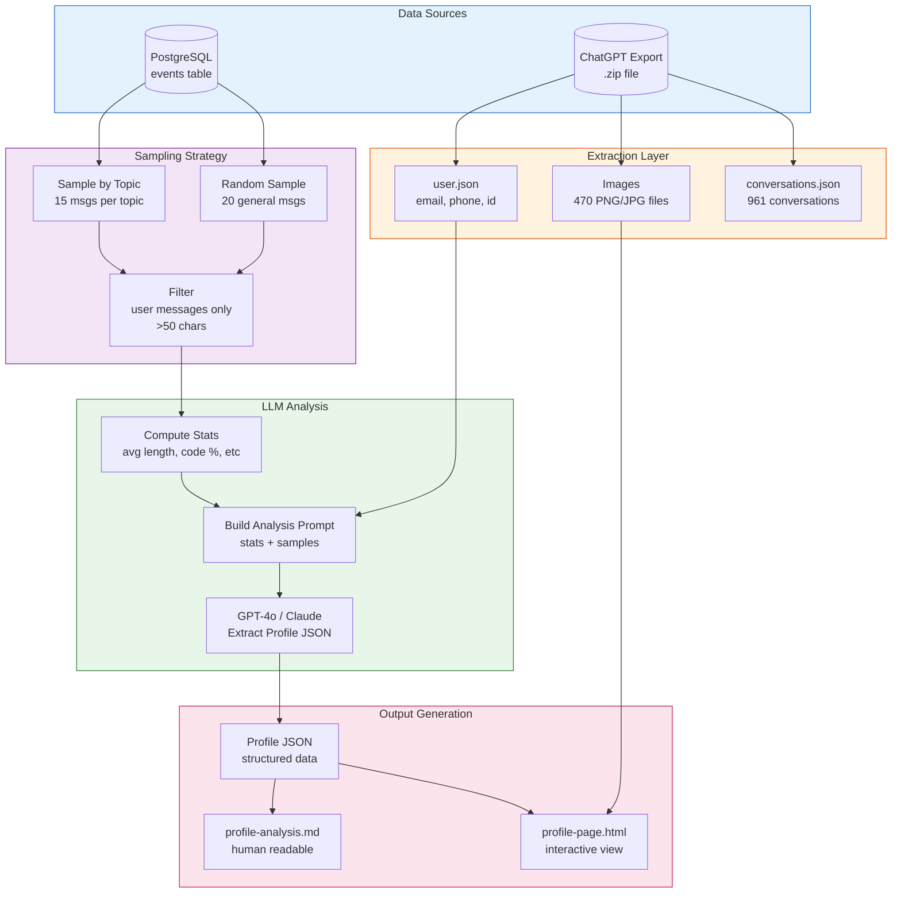
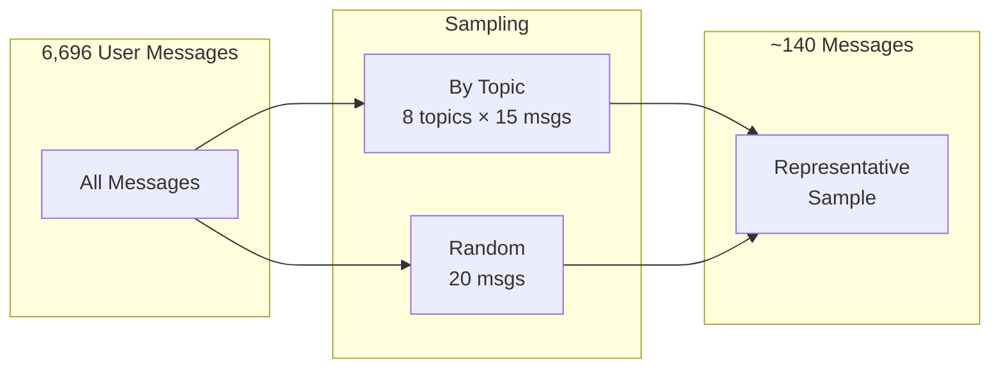

# Profile Analysis Architecture

> **Status:** ✅ Completed  
> **Date:** February 2, 2026  
> **Profile Generated:** Developer Relations Engineer @ PubNub

---

## Overview

This document explains how the deep profile analysis system works, extracting structured insights about you from your ChatGPT conversation history.

---

## Architecture Diagram



---

## Profile Schema

The analysis extracts this structured data:

```typescript
interface ProfileAnalysis {
  // Who you are
  summary: string;
  
  // How you communicate
  communication: {
    style: string;           // "Informal and technical"
    averageLength: string;   // "medium"
    formality: number;       // 1-5 scale
    usesCodeBlocks: boolean;
    preferredFormat: string; // "prose/bullets/mixed"
    vocabulary: string[];    // Notable words/phrases
  };
  
  // Your work context
  professional: {
    role: string;            // "Developer Relations Engineer"
    company: string;         // "PubNub"
    industry: string;        // "Real-Time Messaging"
    skills: string[];
    expertise: string[];
  };
  
  // What you care about
  interests: {
    topics: string[];
    learningAreas: string[];
    recurringThemes: string[];
  };
  
  // Technical preferences
  technical: {
    languages: string[];     // ["JavaScript", "TypeScript"]
    frameworks: string[];    // ["React", "Angular"]
    tools: string[];
    platforms: string[];
    preferences: Record<string, string>;
  };
  
  // How you work
  patterns: {
    problemSolving: string;
    decisionMaking: string;
    questionStyle: string;
    workPatterns: string;
  };
  
  // Actionable insights
  insights: string[];
}
```

---

## Sampling Strategy

We can't send all 6,696 user messages to the LLM (too expensive, too long). Instead:



### Why This Works

| Approach | Pros | Cons |
|----------|------|------|
| All messages | Complete | Too expensive ($$$), context overflow |
| Random only | Simple | May miss important topics |
| **Topic-based** | Ensures coverage | ✓ Best balance |

---

## Data Flow

### Step 1: Gather Statistics

```sql
SELECT 
  COUNT(*) as total_messages,
  COUNT(*) FILTER (WHERE metadata->>'role' = 'user') as user_messages,
  COUNT(DISTINCT thread_id) as conversations,
  MIN(timestamp) as earliest,
  MAX(timestamp) as latest
FROM events
WHERE source = 'chatgpt';
```

**Result:** 15,052 total, 6,696 user messages, 961 conversations

### Step 2: Get Topic Distribution

```sql
SELECT 
  unnest(topic_tags) as topic,
  COUNT(*) as count
FROM events
WHERE source = 'chatgpt'
GROUP BY topic
ORDER BY count DESC;
```

**Result:** coding (570), general (307), writing (218), ...

### Step 3: Sample Messages

```sql
-- Sample 15 messages per topic
SELECT LEFT(text, 2000), timestamp, topic_tags, thread_subject
FROM events e
LEFT JOIN threads t ON e.thread_id = t.id
WHERE 'coding' = ANY(topic_tags)
  AND metadata->>'role' = 'user'
  AND LENGTH(text) > 50
ORDER BY RANDOM()
LIMIT 15;
```

### Step 4: Analyze Patterns Locally

```typescript
const styleStats = {
  avgLength: 1146,        // chars
  usesCode: true,         // >10% have code
  codePercent: 28,
  usesBullets: true,
  questionPercent: 65,
};
```

### Step 5: LLM Analysis

Send to GPT-4o with prompt:
- Statistics summary
- Topic distribution
- 60 sample messages
- Request structured JSON output

**Cost:** ~$0.05-0.10 per analysis

---

## Output Files

### 1. `docs/my-profile.md`

Human-readable markdown with all profile data:

```markdown
# Personal Profile Analysis

> Generated: 2026-02-02
> Based on: 6,696 messages across 961 conversations

## Summary
Developer Relations Engineer at PubNub focused on real-time systems...

## Professional Context
| Attribute | Value |
|-----------|-------|
| **Role** | Developer Relations Engineer |
| **Company** | PubNub |
...
```

### 2. `profile-page.html`

Interactive HTML page with:
- Account info from `user.json`
- Visual topic distribution chart
- Activity timeline
- Image gallery (20 samples from 470 images)
- Recent conversations list
- AI insights

---

## CLI Commands

### Generate Profile Analysis

```bash
# Using OpenAI GPT-4
npm run profile:analyze -- --openai

# Using Claude (if credits available)
npm run profile:analyze

# Custom output path
npm run profile:analyze -- --openai --output ./custom-profile.md
```

### Generate HTML Profile Page

```bash
# Generate interactive HTML
npm run profile:html ./path/to/chatgpt-export.zip

# Custom output
npm run profile:html ./export.zip --output ./my-profile.html
```

---

## Testing the Profile

### Verify Profile Quality

1. **Check the summary** — Does it accurately describe you?
   ```bash
   head -20 docs/my-profile.md
   ```

2. **Verify professional context**
   - Is your role correct?
   - Is your company correct?
   - Are the skills accurate?

3. **Review insights**
   ```bash
   grep -A 20 "## Key Insights" docs/my-profile.md
   ```

4. **Test in search** — Do queries match your profile?
   ```bash
   npm run search "what do I work on"
   npm run search "my programming languages"
   ```

### Re-run Analysis

If profile is inaccurate, re-run with fresh samples:

```bash
npm run profile:analyze -- --openai
```

---

## Files Involved

| File | Purpose |
|------|---------|
| `src/scripts/analyze-profile.ts` | Deep profile analysis script |
| `src/scripts/generate-profile-page.ts` | HTML page generator |
| `docs/my-profile.md` | Generated profile document |
| `profile-page.html` | Interactive HTML profile |

---

## How the Profile is Used

### 1. System Prompts

```typescript
const systemPrompt = `You are assisting ${profile.professional.role} at ${profile.professional.company}.

Communication style: ${profile.communication.style}
Formality: ${profile.communication.formality}/5
Technical expertise: ${profile.professional.expertise.join(', ')}

Key insights:
${profile.insights.map((i, n) => `${n+1}. ${i}`).join('\n')}
`;
```

### 2. Context Selection

Prioritize retrieving events that match:
- Topics in `profile.interests.topics`
- Skills in `profile.professional.skills`
- Languages in `profile.technical.languages`

### 3. Response Formatting

- Match `profile.communication.preferredFormat` (prose/bullets/mixed)
- Match formality level
- Include code blocks if `profile.communication.usesCodeBlocks`

---

## Future Enhancements

1. **Image Analysis** — Use GPT-4 Vision to analyze 470 uploaded images
2. **Temporal Tracking** — Track how profile changes over time
3. **Profile Diff** — Show what's new since last analysis
4. **Auto-refresh** — Re-analyze when new data is imported
5. **Profile Approval** — Let user approve/reject extracted insights

---

## Sample Profile Output

```yaml
summary: "Developer Relations Engineer at PubNub focused on real-time 
          systems, React/TypeScript development, and technical content."

professional:
  role: Developer Relations Engineer
  company: PubNub
  industry: Software Development & Real-Time Messaging
  skills:
    - React
    - TypeScript
    - UI/UX Design
    - SEO Writing
    - Real-Time Systems

technical:
  languages: [JavaScript, TypeScript]
  frameworks: [React, Angular]
  tools: [PubNub, AWS S3, Docker, Jest]
  platforms: [Web, Node.js]

communication:
  style: "Informal and technical"
  formality: 3/5
  usesCodeBlocks: true
  preferredFormat: mixed

insights:
  - Values SEO optimization in content
  - Prefers PubNub for real-time capabilities
  - Regularly works on UI/UX with React/TypeScript
  - Focuses on matchmaking systems
  - Uses Docker and AWS for backends
```

---

*This profile was automatically generated from ChatGPT conversation history.*

